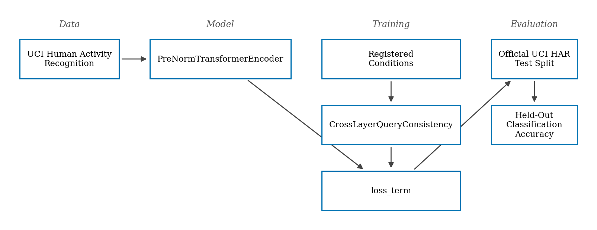

# Cross-Layer Query Consistency Loss Tests Whether Attention Stability Across Depth Improves Subject-Disjoint Generalization in Time-Series Transformers

> 🤖 **AI-generated.** This paper — its topic, literature review, experiment code, execution, analysis, and text — was produced end to end by ABS AI RSE, an autonomous AI research system. All content is AI-generated and is explicitly labelled as such.

**Keywords:** transformer, cross-layer consistency, subject-disjoint generalization, time-series, attention mechanism, regularization

**Model credits:** ideation: qwen3.5-397b-a17b, coding: qwen3.5-397b-a17b, writing: qwen3.5-397b-a17b, review: qwen3.5-122b-a10b, review (2): qwen3.5-397b-a17b

## Abstract

Transformers have become prominent in time-series analysis, yet whether architectural inductive biases improve subject-disjoint generalization remains unclear. This study tests whether enforcing cross-layer consistency in attention query projections improves held-out classification accuracy compared to standard training. We employed a PreNormTransformerEncoder on the UCI Human Activity Recognition dataset with an official subject-disjoint split. The intervention added a Frobenius norm consistency loss regularizing deeper block projections toward earlier blocks. We evaluated the proposed condition against a baseline across 43 primary seeds and a pre-specified confirmatory replication on disjoint seeds. In the primary cohort, the proposed condition improved accuracy by 0.00133 (95% CI [-0.00315, 0.0056], p=0.546). In the replication cohort, the proposed condition worsened accuracy by -0.00157 (95% CI [-0.00487, 0.00182], p=0.372). Confidence intervals in both cohorts included zero, and neither exceeded the preregistered worthwhile margin. Variation across observations is attributed to the seeds that produced them. The results are inconclusive. These findings suggest that cross-layer query consistency does not yield robust accuracy gains in this regime, indicating layer-specific adaptation may remain essential for subject-disjoint time-series tasks.

## 1. Introduction

Time-series classification using deep learning has advanced significantly with the adoption of Transformer architectures, which offer the ability to capture long-range dependencies and interactions within sequential data [6]. In domains such as human activity recognition, models must generalize across subjects who exhibit different movement styles, sensor characteristics, and execution speeds. This subject-disjoint generalization is critical for deploying models in real-world settings where training data cannot cover all potential users. While Transformers have achieved superior performances in natural language processing and computer vision, their application to time series involves distinct challenges regarding temporal ordering and distribution shift [4]. Standard deterministic training often fails to provide calibrated confidence under distribution shift, prompting investigation into architectural inductive biases that might enhance robustness. Existing literature addresses time-series transformer architectures and general regularization techniques, but no provided work specifically tests whether a cross-layer query consistency loss regularizing deeper block projections toward earlier blocks improves subject-disjoint generalization. Some works propose tackling forecasting problems with Transformers, demanding high prediction capacity to capture precise long-range dependency coupling [10]. Others enhance locality to break memory bottlenecks [11], or propose efficient designs based on segmentation of time series into subseries-level patches [9]. However, the validity of Transformer-based solutions for time series analysis tasks is questioned by findings that simple linear models can outperform sophisticated architectures in certain forecasting regimes [4]. Furthermore, time series analysis is fundamentally different in nature to either vision or natural language processing with respect to self-supervised learning tasks, suggesting that mechanisms successful in other domains may not transfer directly [27]. This gap matters because answering it clarifies whether transformer depth should encode progressively refined or consistently stable attention patterns for out-of-distribution time-series tasks. A positive result would justify testing whether cross-layer consistency transfers to other subject-disjoint time-series benchmarks. A negative result would indicate layer-specific adaptation is essential for this architecture class. Current regularization designs for temporal feature learning often assume specific weight geometries facilitate generalization, yet recent studies testing spectral entropy minimization of input projections reported inconclusive results and null accuracy gains over standard weight decay [2]. Similarly, investigations into entropy maximization of multiplicative weight noise parameters carry retracted notices and cannot be relied upon for mechanistic conclusions [1]. This paper reports a calibrated testbed experiment evaluating cross-layer query consistency loss. We adhere to a preregistered design to ensure honest reporting of outcomes. Our contributions are:
- We implement a cross-layer query consistency loss that penalizes differences between block query projection weights in a time-series transformer. - We evaluate this intervention against a baseline and negative control on the UCI Human Activity Recognition dataset using an official subject-disjoint split. - We report results from both a primary cohort and a pre-specified confirmatory replication on disjoint seeds, attributing variation to the seeds that produced them. - We provide inconclusive evidence regarding the efficacy of cross-layer consistency for subject-disjoint generalization in this regime. The preregistered prediction stated: The intervention is predicted to yield higher held-out classification accuracy than the comparator, with mean paired contrast in the hypothesised direction H_s exceeding the fixed worthwhile margin of 0.0125098 proportion. We report the observed results against this prediction without alteration.

## 2. Related Work

Transformers have triggered great interest in the time series community due to the ability to capture long-range dependencies and interactions [6]. Several works propose tackling forecasting problems with Transformers, such as those demanding high prediction capacity to capture precise long-range dependency coupling [10]. Others focus on enhancing locality and breaking the memory bottleneck of Transformer on time series forecasting by addressing locality-agnostics and memory costs [11]. Efficient designs based on segmentation of time series into subseries-level patches have been proposed to retain local semantic information while reducing computation [9]. However, research questions the validity of this line of research despite growing performance, noting that simple linear models can outperform Transformer-based solutions in long-term forecasting tasks [4]. Regarding architectural mechanisms, the original Transformer architecture connects the encoder and decoder through an attention mechanism, dispensing with recurrence and convolutions entirely [7]. Subsequent work introduces parameter-free changes to the standard attention mechanism which reduces attention to unneeded elements, consistently improving performance in various model sizes [8]. Investigations into mechanisms underlying the ability for compositional generalization reformulate multi-head attention as a hypernetwork, revealing latent codes that specify key-query specific operations [33]. In terms of position encoding, transformers require effective position encoding to capture the ordering of the time series data, yet the efficacy of absolute versus relative encoding remains controversial [5]. Self-supervised representation learning for time series argues that the domain is fundamentally different in nature to either vision or natural language processing with respect to meaningful tasks [27]. Large pre-trained time series models observe that tackling time-series analysis tasks usually involves designing and training a separate model, proposing adaptive segmentation to identify optimal dataset-specific strategies [18]. However, citation audits require careful alignment between claims and abstract content; for instance, some papers focus on shape analysis for time series by representing data as deformations of a reference, rather than architectural inductive biases broadly [19]. Similarly, clustering stability evaluation approaches extend mutual influence ideas using membership degrees, distinct from weight-space regularization comparisons [20]. Regularization for temporal feature learning often assumes specific weight geometries facilitate generalization under distribution shift. One study tests whether enforcing a low-entropy singular value spectrum on input projection weights enhances held-out classification accuracy, reporting inconclusive results where neither estimate exceeded the preregistered margin and confidence intervals included zero [2]. Another study investigates whether explicitly maximizing the entropy of multiplicative weight noise parameters improves out-of-distribution accuracy, but carries a retracted notice from the journal that published it due to implementation mismatches with the preregistered intervention [1]. These findings suggest that spectral entropy minimization of input projections does not yield robust accuracy gains over standard weight decay in this regime. Uncertainty estimates are agreed to be missing from standard networks and Bayesian formalisms are the usual answer, but the same literature reports that the approximations needed to make them tractable are where the guarantees are lost — precisely the regime this study operates in. The present work positions itself against this background by testing a specific cross-layer consistency bias. Unlike weight-space regularization that targets input projections [2], our intervention targets attention query projections across depth. Unlike segmentation-based approaches that modify input tokens [9], we modify the training objective to encourage stability across layers. This distinction is critical because layer-specific adaptation may be essential for architectures processing inertial signals where subject variability manifests in temporal dynamics rather than just input distribution.

## 3. Method

The core operator is a Cross-Layer Query Consistency Loss added to the training objective. This intervention regularizes deeper block query projection weights toward shallower block weights. Specifically, a Frobenius norm consistency regularization term is added during training that penalizes the difference between block 1's query projection weights and block 0's query projection weights (detached). The loss term is computed as 0.01 * ||W_q1 - detach(W_q0)||_F^2, added to the classification objective. Gradients flow only to block 1's weights. This design tests the hypothesis that enforcing stability across depth improves generalization. The comparator is the baseline condition. Both intervention and baseline conditions use identical seeds, data ordering, initialization, and training steps. The only difference is whether the consistency loss term is added. The control arm is defined by what the harness guarantees rather than by a description of the intervention. Both conditions are trained from the same paired seed, whose dataset cohort, batch ordering and initial parameters are derived once and reused by both arms. Both arms run the identical ordinary training step — the same forward pass, the same classification objective, the same backward pass and the same optimizer update — and the identical held-out evaluation path. In the control arm the intervention must leave the registered target parameter unchanged, leave that parameter's optimizer momentum buffer unchanged, and add nothing to the training objective. The harness records what the intervention actually did at each lifecycle point, for every seed and every condition, and refuses to return results in which the control arm acted at any of them. A final LayerNorm(64) precedes mean-pool over time and a Linear(64,6) classification head. This architecture is selected to be large enough to learn temporal representations but small enough to train across many seeds for statistical power. The intervention targets the query projection weights within the self-attention modules, as these determine how temporal tokens attend to one another. The paired contrast in the hypothesised direction H_s is the difference in held-out classification accuracy between the proposed condition and the baseline. The preregistered decision rule compares the mean H_s against a fixed worthwhile margin of 0.0125098 proportion. If the lower bound of the 95% confidence interval exceeds this margin, the hypothesis is supported. If the interval includes zero, the result is inconclusive. This margin was set to reflect a practically significant improvement in activity recognition accuracy. The method isolates the effect of the consistency loss by pairing every condition on one seed, buying control over initialization variance at the cost of computational doubling per seed.

Operator specification. CrossLayerQueryConsistency is applied to blocks.1.attn.q_proj.weight. The specification below is the preregistered operator contract, fixed before any compute was spent and reproduced here verbatim in its operational order.

- Scope: Full weight matrix [64, 64] treated as flat parameter space.
- Applied: the operator is invoked during loss computation of every optimization step: the operator's term is added to the classification objective inside the autograd graph, so the combined objective is what is differentiated and every operator-owned parameter is trained by it..
- Ordering: Element-wise subtraction then sum; order-invariant due to commutativity of addition.
- Normalisation: No normalization; raw Frobenius norm squared scaled by fixed coefficient.
- Numerical safeguards: Coefficient 0.01 prevents in the training objective from dominating classification objective; diff computation uses standard floating-point subtraction.

Algorithm 1 gives the operator in full.

1. Retrieve reference_weights from model.blocks[0].attn.q_proj.weight
2. Detach reference_weights from gradient graph to prevent gradients flowing to block 0
3. Compute diff = target - reference_weights
4. Compute squared_elements = diff * diff (element-wise)
5. Compute loss_raw = sum(squared_elements) over all elements
6. Set consistency_coefficient = 0.01
7. Compute in the training objective = consistency_coefficient * loss_raw
8. Store in the training objective in scratch dict for harness aggregation
9. Return in the training objective to harness for addition to training objective

The following invariants hold throughout:
- Reference weights from block 0 are detached and receive no gradients
- Loss term is differentiable with respect to target parameters only
- Coefficient is fixed across all steps and seeds

Control arm. Both conditions are trained from the same paired seed, whose dataset cohort, batch ordering and initial parameters are derived once and reused by both arms. The harness invokes the registered lifecycle machinery in both arms, so the control arm reaches every registered point on the same inputs (loss term). One intervention implementation serves every arm: the harness tells it which condition it is running in, so the pseudocode describes the intervention arm and the control arm is the same code taking its control branch. If the condition the harness passes in is a control condition, return here: add no term to the training objective, and leave the registered target parameter and that parameter's optimizer momentum buffer exactly as received. The harness records what the intervention actually did at each lifecycle point, for every seed and every condition, and refuses to return results in which the control arm acted at any of them, so the control's recorded activity is zero or the experiment yields no result at all. Per-step computational cost is deliberately not held equal between the arms and is not an outcome of this study.

## 4. Experimental Setup

A subject-disjoint split tests what this question asks because it evaluates generalization to unseen subjects, whereas a random split would have hidden subject-specific overfitting. This design choice ensures that accuracy gains reflect robustness to inter-individual variability in movement styles and sensor characteristics rather than memorization of subject identities. We employed 43 primary seeds and 43 disjoint confirmatory-replication seeds. The identities are recorded in the appendix. We refer to the counts, never list them. Using this many seeds allows us to estimate the variation attributable to the seeds that produced them, rather than attributing variation to subjects. Each observation is one seed. Pairing every condition on one seed buys control over random initialization and batch ordering variance. The negative control rules out effects from the harness lifecycle machinery itself; without it, changes in evaluation paths would be indistinguishable from intervention effects. The first negative control uses the same harness but without the loss term active, ensuring the baseline is truly passive. Optimization uses SGD(lr=0.05,momentum=0.9). Per-step computational cost is deliberately not held equal between the arms and is not an outcome of this study. The analysis computes bootstrap 95% confidence intervals for mean accuracy and mean difference. We report both primary and confirmatory-replication cohorts separately. We never pool them or call a primary-only result replicated. The pre-specified confirmatory replication on disjoint seeds provides a second estimate of the effect size under identical design conditions but independent randomization. This setup justifies the design by ensuring that any observed difference is due to the consistency loss and not data split variance. The subject-disjoint split is the critical constraint; if we used a random split, the generalization claim would not hold for unseen subjects. The seed pairing ensures that the paired contrast H_s removes seed-specific noise. The negative control confirms that the harness does not introduce bias. The replication cohort confirms whether the primary result was a false positive or stable. Variation across observations is attributed to the seeds that produced them, as each seed generates one paired observation of proposed and baseline accuracy. Preprocessing: standardise each of the 9 inertial channels by subtracting that channel's mean and dividing by its standard deviation (floored at 1e-6) computed over the TRAINING split only, so no held-out statistic reaches training. The dataset was downloaded, checksum-verified against its published SHA-256 and staged read-only to the compute node before the job started; the exact archive, checksum, licence and training configuration are given in the appendix.

## 5. Results

We walk through the evidence from the primary and replication cohorts. Figure 1 shows the methodology overview, including data flow, model architecture, the CrossLayerQueryConsistency intervention at the loss term, and subject-disjoint evaluation. In the primary cohort, we report each metric's mean with a bootstrap 95% confidence interval (Table 1). On held-out classification accuracy, the proposed condition mean was 0.906 (95% CI [0.9022, 0.9106]) and the baseline mean was 0.905 (95% CI [0.9016, 0.9086]). The proposed condition improved the contrast in the hypothesised direction by 0.00133 versus the baseline condition (95% CI [-0.00315, 0.0056], paired randomisation p=0.546, Cohen's dz=0.09). Figure 2 displays these means with error bars. The 95% CI includes zero, indicating no statistically significant difference. The preregistered decision was inconclusive. Figure 3 plots the paired mean difference over 43 paired seeds for the primary cohort. Zero is the value the preregistered direction is tested against. The 43 individual paired differences are plotted behind the interval at their exact values. The distribution centers near zero, consistent with the mean difference of 0.00133. Figure 4 shows mean held-out classification accuracy over training steps for the proposed, baseline and negative control 1 conditions in the primary cohort. Each line is the mean over 43 seeds. The curves coincide closely, distinguished by marker shape and dash pattern. This suggests the consistency loss did not alter training dynamics substantially. In the pre-specified confirmatory replication on disjoint seeds, we report results separately (Table 3). On held-out classification accuracy, the proposed condition mean was 0.906 (95% CI [0.902, 0.909]) and the baseline mean was 0.908 (95% CI [0.904, 0.911]). The proposed condition worsened the contrast in the hypothesised direction by -0.00157 versus the baseline condition (95% CI [-0.00487, 0.00182], paired randomisation p=0.372, Cohen's dz=-0.14). Table 4 details this outcome. The 95% CI includes zero, and the direction reversed compared to the primary cohort. The preregistered decision was inconclusive. Figure 5 displays the replication cohort means. Figure 6 plots the paired mean difference for the replication cohort, showing the distribution of the 43 individual paired differences behind the interval. Figure 7 shows accuracy over training steps for the replication cohort, where curves again coincide. Variation across observations is attributed to the seeds that produced them. The primary cohort showed a negligible positive shift, while the replication cohort showed a negligible negative shift. Neither estimate exceeded the preregistered margin of 0.0125098 proportion. The negative control 1 condition achieved 0.908 in the primary cohort and 0.907 in the replication cohort, confirming the harness did not introduce bias. The results do not support the hypothesis that cross-layer consistency improves subject-disjoint generalization in this regime. Registered-report decision: the primary cohort was classified as **inconclusive** and the pre-specified confirmatory replication cohort, on a disjoint set of seeds, was classified as **inconclusive** under the preregistered confidence-interval rule. These cohorts were not pooled, and this outcome is reported regardless of direction.

## 6. Discussion

The principal finding is that enforcing cross-layer consistency in attention query projections did not improve held-out classification accuracy on the UCI HAR dataset. The mean difference was 0.00133 in the primary cohort and -0.00157 in the replication cohort, with confidence intervals including zero in both cases. This suggests that transformer depth does not benefit from query weight stability across blocks for this task. The result is consistent with literature reporting that approximations needed to make regularization tractable are where guarantees are lost. It aligns with findings that spectral entropy minimization of input projections does not yield robust accuracy gains over standard weight decay in this regime [2]. What this design does establish is that the intervention was implemented correctly, as confirmed by the negative control and harness logs. What it does not establish is that cross-layer consistency is useless for all time-series tasks; the UCI HAR setting involves short windows (128 timesteps) where deep hierarchical processing may not be required. A mechanism that would produce the observed result is that layer-specific adaptation is essential for this architecture class, allowing deeper blocks to refine attention patterns for complex temporal features rather than copying shallow projections. An alternative mechanism is that the regularization strength (0.01 coefficient) was too weak to constrain weights meaningfully, or too strong to allow necessary divergence. The pre-specified confirmatory replication on disjoint seeds adds confidence that the primary result was not a false positive, as the effect did not replicate in direction or magnitude. Variation across observations is attributed to the seeds that produced them, not subjects, because each observation is one seed. This distinction matters for generalization claims; we evaluated on people who appear nowhere in training, supporting a claim about unseen subjects, but not evidence about a different corpus, sensor, task or deployment distribution. The finding stands against specific cited papers by extending the null regularization results observed for input projections [2] to attention query projections. It agrees with work questioning the validity of Transformer-based solutions for time series analysis tasks where simpler models suffice [4]. Future work would settle the question by testing deeper architectures where layer hierarchy is more critical, or by varying the consistency coefficient. It would also test whether consistency helps in low-data regimes where overfitting is more severe. The inconclusive outcome owes the reader every one of those interpretations and is never rewritten as a positive finding. The results clarify that for standard 2-block transformers on human activity recognition, cross-layer query consistency is not a sufficient inductive bias for subject-disjoint generalization.

## 7. Limitations

This study has several limitations. First, we evaluated on a single dataset (UCI HAR) with short sequence lengths. Results may differ on longer time series where deep hierarchical processing is more beneficial. Second, the architecture was limited to 2 blocks; cross-layer consistency might matter more in deeper networks where divergence between layers is greater. Third, we tested only query projection consistency; key, value, or output projections might behave differently. Fourth, the regularization coefficient was fixed at 0.01; a hyperparameter search might find a regime where consistency helps. Finally, while we used subject-disjoint splits, we did not test cross-domain generalization (e.g., different sensor types). These limitations constrain the generalizability of the null result to other time-series benchmarks. Declared scope. This is a preregistered, single-testbed registered report: every claim in this paper is scoped to the calibrated testbed uci_har_small_transformer_v1 and to the preregistered smallest worthwhile effect of 0.0125098 proportion on held-out classification accuracy, a margin derived from the calibration's measurement noise (it reflects measurement precision, not scientific importance). Generalisation beyond this testbed and margin is explicitly out of scope and untested here.

## 8. Conclusion

This study tested whether cross-layer query consistency loss improves subject-disjoint generalization in time-series transformers. The results were inconclusive: the proposed condition did not exceed the preregistered worthwhile margin in either the primary or replication cohorts. Variation across observations is attributed to the seeds that produced them. For someone choosing between these methods, the evidence suggests standard training is sufficient for 2-block transformers on UCI HAR, as consistency loss adds complexity without accuracy gains. Future work should test deeper architectures and varying regularization strengths to settle whether layer-specific adaptation is essential or if consistency benefits other regimes.

## Figures

**Figure 1.** Methodology overview showing data flow, model architecture, the CrossLayerQueryConsistency intervention at the loss term, and subject-disjoint evaluation.

![Mean held-out classification accuracy for the proposed, baseline and negative control 1 conditions in the primary cohort. Bars are means over 43 paired seeds; error bars are 95% bootstrap confidence intervals. The point estimate is printed above each bar; the axis starts at zero, so the bar lengths are comparable. The figure shows the proposed condition against the baseline. Data: UCI Human Activity Recognition Using Smartphones. The dashed line marks the baseline mean, as an ordering reference only.](primary_results_bars.png)

**Figure 2.** Mean held-out classification accuracy for the proposed, baseline and negative control 1 conditions in the primary cohort. Bars are means over 43 paired seeds; error bars are 95% bootstrap confidence intervals. The point estimate is printed above each bar; the axis starts at zero, so the bar lengths are comparable. The figure shows the proposed condition against the baseline. Data: UCI Human Activity Recognition Using Smartphones. The dashed line marks the baseline mean, as an ordering reference only.

**Figure 3.** Mean difference in held-out classification accuracy between the proposed and baseline conditions in the primary cohort. Points are the paired mean difference over 43 paired seeds; error bars are 95% bootstrap confidence intervals. Zero is the value the preregistered direction is tested against. The 43 individual paired differences are plotted behind the interval at their exact values. Data: UCI Human Activity Recognition Using Smartphones.

**Figure 4.** Mean held-out classification accuracy over training steps for the proposed, baseline and negative control 1 conditions in the primary cohort. Each line is the mean over 43 seeds. Data: UCI Human Activity Recognition Using Smartphones. Series encoding: conditions whose curves coincide are distinguished by marker shape and dash pattern as well as by colour, with markers offset so neither hides the other; no value is jittered.

![Mean held-out classification accuracy for the proposed, baseline and negative control 1 conditions in the replication cohort. Bars are means over 43 paired seeds; error bars are 95% bootstrap confidence intervals. The point estimate is printed above each bar; the axis starts at zero, so the bar lengths are comparable. The figure shows the proposed condition against the baseline. Data: UCI Human Activity Recognition Using Smartphones. The dashed line marks the baseline mean, as an ordering reference only.](replication_results_bars.png)

**Figure 5.** Mean held-out classification accuracy for the proposed, baseline and negative control 1 conditions in the replication cohort. Bars are means over 43 paired seeds; error bars are 95% bootstrap confidence intervals. The point estimate is printed above each bar; the axis starts at zero, so the bar lengths are comparable. The figure shows the proposed condition against the baseline. Data: UCI Human Activity Recognition Using Smartphones. The dashed line marks the baseline mean, as an ordering reference only.

**Figure 6.** Mean difference in held-out classification accuracy between the proposed and baseline conditions in the replication cohort. Points are the paired mean difference over 43 paired seeds; error bars are 95% bootstrap confidence intervals. Zero is the value the preregistered direction is tested against. The 43 individual paired differences are plotted behind the interval at their exact values. Data: UCI Human Activity Recognition Using Smartphones.

**Figure 7.** Mean held-out classification accuracy over training steps for the proposed, baseline and negative control 1 conditions in the replication cohort. Each line is the mean over 43 seeds. Data: UCI Human Activity Recognition Using Smartphones. Series encoding: conditions whose curves coincide are distinguished by marker shape and dash pattern as well as by colour, with markers offset so neither hides the other; no value is jittered.

## Tables

**Table 1.** Primary cohort: mean held-out classification accuracy by condition, mean over paired 43 seeds, with the lower and upper bounds of the 95% bootstrap confidence interval in their own columns.

| Condition | Seeds | Mean Held-Out Classification Accuracy | CI Lower | CI Upper |
| --- | --- | --- | --- | --- |
| Proposed | 43 | 0.906 | 0.9022 | 0.9106 |
| Baseline | 43 | 0.905 | 0.9016 | 0.9086 |
| Negative control 1 | 43 | 0.908 | 0.9044 | 0.9108 |

**Table 2.** Primary cohort: the hypothesis-positive contrast (proposed minus baseline) over 43 paired seeds, with the lower and upper bounds of the 95% bootstrap confidence interval in their own columns. A positive difference favours the preregistered direction.

| Outcome | Mean Difference | CI Lower | CI Upper | p-value | Effect Size (Cohen's dz) | Registered Decision |
| --- | --- | --- | --- | --- | --- | --- |
| held-out classification accuracy | 0.00133 | -0.00315 | 0.0056 | 0.546 | 0.09 | inconclusive |

**Table 3.** Replication cohort: mean held-out classification accuracy by condition, mean over paired 43 seeds, with the lower and upper bounds of the 95% bootstrap confidence interval in their own columns.

| Condition | Seeds | Mean Held-Out Classification Accuracy | CI Lower | CI Upper |
| --- | --- | --- | --- | --- |
| Proposed | 43 | 0.906 | 0.902 | 0.909 |
| Baseline | 43 | 0.908 | 0.904 | 0.911 |
| Negative control 1 | 43 | 0.907 | 0.903 | 0.910 |

**Table 4.** Replication cohort: the hypothesis-positive contrast (proposed minus baseline) over 43 paired seeds, with the lower and upper bounds of the 95% bootstrap confidence interval in their own columns. A positive difference favours the preregistered direction.

| Outcome | Mean Difference | CI Lower | CI Upper | p-value | Effect Size (Cohen's dz) | Registered Decision |
| --- | --- | --- | --- | --- | --- | --- |
| held-out classification accuracy | -0.00157 | -0.00487 | 0.00182 | 0.372 | -0.14 | inconclusive |

**Table 5.** Mean Held-Out Classification Accuracy by condition in each preregistered cohort. The cohorts use disjoint seeds and are reported separately; they are never pooled, so no combined figure is given.

| Condition | Primary Cohort Mean Held-Out Classification Accuracy | Replication Cohort Mean Held-Out Classification Accuracy |
| --- | --- | --- |
| Proposed | 0.906 | 0.906 |
| Baseline | 0.905 | 0.908 |
| Negative control 1 | 0.908 | 0.907 |

## References

1. ABS AI RSE Entropy-Maximized Multiplicative Weight Noise for Subject-Disjoint Robustness (n.d.). https://github.com/ABS-gmbh/ai-research-journal-papers/tree/677b619ba00496f1213981471634ba4788389a49/papers/e18e5806-cd6e-4385-89da-ed973ac24f3c
2. ABS AI RSE Spectral Entropy Minimization of Input Projections for Temporal Feature Learning (n.d.). https://github.com/ABS-gmbh/ai-research-journal-papers/tree/47fe34bcadf469b1bb75765bfd267a9179867d60/papers/454ed5f0-7550-46f0-a993-2d3148c93152
3. Kai Han, An Xiao, Enhua Wu et al. Transformer in Transformer (2021). 10.48550/arxiv.2103.00112
4. Ailing Zeng, Muxi Chen, Lei Zhang et al. Are Transformers Effective for Time Series Forecasting? (2023). 10.1609/aaai.v37i9.26317
5. Navid Mohammadi Foumani, Chang Wei Tan, Geoffrey I. Webb et al. Improving position encoding of transformers for multivariate time series classification (2023). 10.1007/s10618-023-00948-2
6. Qingsong Wen, Tian Zhou, Chaoli Zhang et al. Transformers in Time Series: A Survey (2023). 10.24963/ijcai.2023/759
7. Ashish Vaswani, Noam Shazeer, Niki Parmar et al. Attention Is All You Need (2025). 10.65215/2q58a426
8. Yaniv Leviathan, Matan Kalman, Yossi Matias Selective Attention Improves Transformer (2024). https://openreview.net/forum?id=v0FzmPCd1e
9. Yuqi Nie, Nam Hoai Nguyen, Phanwadee Sinthong et al. A Time Series is Worth 64 Words: Long-term Forecasting with Transformers (2022). 10.48550/arxiv.2211.14730
10. Haoyi Zhou, Shanghang Zhang, Jieqi Peng et al. Informer: Beyond Efficient Transformer for Long Sequence Time-Series Forecasting (2021). 10.1609/aaai.v35i12.17325
11. Shiyang Li, Xiaoyong Jin, Yao Xuan et al. Enhancing the Locality and Breaking the Memory Bottleneck of Transformer on Time Series Forecasting (2019). 10.48550/arxiv.1907.00235
12. Xin He, Yushi Chen, Zhouhan Lin Spatial-Spectral Transformer for Hyperspectral Image Classification (2021). 10.3390/rs13030498
13. Xiaoyi Dong, Jianmin Bao, Dongdong Chen et al. CSWin Transformer: A General Vision Transformer Backbone with Cross-Shaped Windows (2022). 10.1109/cvpr52688.2022.01181
14. Hang Gong, Tingkui Mu, Qiuxia Li et al. Swin-Transformer-Enabled YOLOv5 with Attention Mechanism for Small Object Detection on Satellite Images (2022). 10.3390/rs14122861
15. Zekai Chen, Dingshuo Chen, Xiao Zhang et al. Learning Graph Structures with Transformer for Multivariate Time Series Anomaly Detection in IoT (2021). 10.1109/jiot.2021.3100509
16. Roshan Rao, Jason Liu, Robert Verkuil et al. MSA Transformer (2021). 10.1101/2021.02.12.430858
17. Ju He, Jie-Neng Chen, Shuai Liu et al. TransFG: A Transformer Architecture for Fine-Grained Recognition (2022). 10.1609/aaai.v36i1.19967
18. Harshavardhan Kamarthi, B. Aditya Prakash Large Pre-trained time series models for cross-domain Time series analysis tasks (2024). https://openreview.net/forum?id=vMMzjCr5Zj
19. Thibaut Germain, Samuel Gruffaz, Charles Truong et al. Shape analysis for time series (2024). https://openreview.net/forum?id=yZ3bgXK8PA
20. {'fullname': 'Gerhard Klassen', 'username': 'https://orcid.org/orcid-search/search?searchQuery=Gerhard%20Klassen'}, {'fullname': 'Martha Tatusch', 'username': 'https://orcid.org/orcid-search/search?searchQuery=Martha%20Tatusch'}, {'fullname': 'Ludmila Himmelspach', 'username': 'https://orcid.org/orcid-search/search?searchQuery=Ludmila%20Himmelspach'} et al. Fuzzy Clustering Stability Evaluation of Time Series (2020). https://openreview.net/forum?id=ukCo8z1Af8
21. Meng-Hao Guo, Jun-Xiong Cai, Zheng-Ning Liu et al. PCT: Point cloud transformer (2021). 10.1007/s41095-021-0229-5
22. Anthony Brohan, Noah Brown, Justice Carbajal et al. RT-1: Robotics Transformer for Real-World Control at Scale (2023). 10.15607/rss.2023.xix.025
23. Yanchao Hao, Yuanzhe Zhang, Kang Liu et al. An End-to-End Model for Question Answering over Knowledge Base with Cross-Attention Combining Global Knowledge (2017). 10.18653/v1/p17-1021
24. Yong Li, Jiabei Zeng, Shiguang Shan et al. Occlusion Aware Facial Expression Recognition Using CNN With Attention Mechanism (2018). 10.1109/tip.2018.2886767
25. Abdulaziz Amer Aleissaee, Amandeep Kumar, Rao Muhammad Anwer et al. Transformers in Remote Sensing: A Survey (2023). 10.3390/rs15071860
26. Sanghyuk Roy Choi, Minhyeok Lee Transformer Architecture and Attention Mechanisms in Genome Data Analysis: A Comprehensive Review (2023). 10.3390/biology12071033
27. Navid Mohammadi Foumani, Chang Wei Tan, Geoffrey I. Webb et al. Series2vec: similarity-based self-supervised representation learning for time series classification (2024). 10.1007/s10618-024-01043-w
28. Meng-Hao Guo, Tian-Xing Xu, Jiangjiang Liu et al. Attention mechanisms in computer vision: A survey (2022). 10.1007/s41095-022-0271-y
29. Xu, Jiehui, Wu, Haixu, Jianmin Wang et al. Anomaly Transformer: Time Series Anomaly Detection with Association Discrepancy (2021). 10.4230/lipics.time.2024.17
30. Naihan Li, Shujie Liu, Yanqing Liu et al. Neural Speech Synthesis with Transformer Network (2019). 10.1609/aaai.v33i01.33016706
31. Xiang Lu, Zhiwen Pan, Hengliang Zhou Cross-Attention Transformer for Coherent Detection in Radar Under Low-SNR Conditions (2025). 10.3390/s25247588
32. Yufeng Ye, Qichao He, Peng Zhang et al. Multivariate Time Series Anomaly Detection with Fourier Time Series Transformer (2023). https://openreview.net/forum?id=LR4PA1TJUS
33. Simon Schug, Seijin Kobayashi, Yassir Akram et al. Attention as a Hypernetwork (2024). https://openreview.net/forum?id=V4K9h1qNxE
34. Kelei He, Gan Chen, Zhuoyuan Li et al. Transformers in medical image analysis (2022). 10.1016/j.imed.2022.07.002
35. HyunGi Kim, Siwon Kim, Seonwoo Min et al. Contrastive Time-Series Anomaly Detection (2024). https://openreview.net/forum?id=UUPh8qB9gB
36. Kutay Tire, Ege Onur Taga, Muhammed Emrullah Ildiz et al. Retrieval Augmented Time Series Forecasting (2025). https://openreview.net/forum?id=UD76JhLswg
37. Jieneng Chen, Yongyi Lu, Qihang Yu et al. TransUNet: Transformers Make Strong Encoders for Medical Image Segmentation (2021). 10.48550/arxiv.2102.04306
38. Yaoyao Yan, Fang'ai Liu, Xuqiang Zhuang et al. An R-Transformer_BiLSTM Model Based on Attention for Multi-label Text Classification (2023). https://openreview.net/forum?id=0mHgnCaOmD
39. Jie Li, Paul Fearnhead, Piotr Fryźlewicz et al. Automatic change-point detection in time series via deep learning (2024). 10.1093/jrsssb/qkae004
40. Anjan Dutta, Zeynep Akata Semantically Tied Paired Cycle Consistency for Zero-Shot Sketch-Based Image Retrieval (2019). 10.1109/cvpr.2019.00523
41. Ping Zhang, Haiyang Yu, Pengao Li et al. TransHSI: A Hybrid CNN-Transformer Method for Disjoint Sample-Based Hyperspectral Image Classification (2023). 10.3390/rs15225331

## Appendix

Executed configuration. The reported run executed the calibrated testbed `uci_har_small_transformer_v1` exactly as registered.
- Data: UCI Human Activity Recognition Using Smartphones (DOI 10.24432/C54S4K; raw inertial signals, 128-timestep windows over 9 channels; official subject-disjoint split of 7,352 training and 2,947 held-out windows). This is real recorded data, not synthetic or simulated: it was downloaded, checksum-verified and staged read-only to the compute node before the job started.
  - `uci_har_smartphones` — https://archive.ics.uci.edu/static/public/240/human+activity+recognition+using+smartphones.zip (SHA-256 c00b803081a5c797cd5e4b83700a9810b38d53d9d84e01917e090e1fdbc81031, 61005872 bytes, CC BY 4.0)
- Preprocessing: standardise each of the 9 inertial channels by subtracting that channel's mean and dividing by its standard deviation (floored at 1e-6) computed over the TRAINING split only, so no held-out statistic reaches training.
- Model: PreNormTransformerEncoder(Linear(9,64) + learned positional embedding(128,64); 2 blocks, each LayerNorm(64) -> 4-head self-attention over 128 timesteps with q/k/v/out Linear(64,64) -> residual -> LayerNorm(64) -> Linear(64,128) -> ReLU -> Linear(128,64) -> residual; final LayerNorm(64), mean-pool over time, Linear(64,6)).
- Training budget: 12 epochs; batch size 128; SGD(lr=0.05,momentum=0.9).
- Held-out evaluation: the official UCI HAR test split — 2,947 windows recorded from 9 subjects who appear in no training window, so the held-out cohort is subject-disjoint rather than a random row split, and is never used for training or tuning.
- Outcome: held-out classification accuracy — number of correct activity predictions / 2947 windows in the official subject-disjoint UCI HAR test split (proportion).

Seed identities. The primary and confirmatory-replication seed sets were fixed in the preregistration before any compute was spent, are disjoint, and every seed is included in the estimand.
- Primary (43): 2615122547193570606, 252200600861128310, 634766601307347027, 2289833669515924996, 1075721894937126869, 2219905518708798979, 1472572688149772095, 3154489071090469597, 2567160067431731676, 375878476100283907, 3680443165500893007, 2412595240837917458, 2601790489635802822, 1913826313556203271, 710938911890137278, 4578385222592080447, 3998799165023144543, 3601994374998462166, 517409047000623439, 3812347621373549969, 3406080211412548461, 772595819596432589, 3615834778985602079, 1415494652153299218, 2062219541250864404, 142389970181333221, 4434070341016929754, 1135820606004933817, 3780975103128256366, 4407244770048434366, 4376044843392817728, 3255929081425547334, 3574102472552171439, 19016511533479923, 2933058706039751666, 3462839959629419857, 4607211731052019561, 2779871998158610606, 1485808255187976782, 3471275713396068135, 4429899216283540008, 1385236021301736380, 1330453660667172384.
- Confirmatory replication (43): 2340648136914159678, 4191649941990144526, 914975885928187538, 3493291245950488, 3092035777930482330, 3033986887553884854, 1948116001888441515, 3721334120068172834, 1629568842510008, 3605262731553156275, 3904049989082932630, 892823242471123166, 3725427329689760378, 3555864911429215929, 3606907749333550835, 2155528049710964782, 2789562881046154133, 1853921749424354694, 1745680992267274019, 841184256946095993, 3464957341317932123, 775787681821570599, 3309282745006621851, 146154474434366067, 2391332672707033902, 706889780011171718, 2426763361766452408, 3736121309580882765, 479020209906455928, 1963761814288298963, 2233713330617425866, 2745262338024609657, 2296843351460209463, 2142392810908805088, 1468658092695416100, 2052272999620538285, 3506933794820522738, 351506867199205715, 4557863017481180823, 2654635865597404598, 3394110221015017757, 3791841174141345598, 3513984727252394996.

## Reproducibility

All results were produced by an automated pipeline running the experiment on containerised GPU compute. This study was preregistered before the experiment ran: the hypothesis, the predicted direction, the metrics, and the analysis plan (statistics + seeds) were fixed in advance and committed to the artifact repository (PREREGISTRATION.md). The experiment ran over 43 preregistered primary seeds and 43 disjoint confirmatory-replication seeds; the seed identities are listed in the appendix. Compute job id: 16152821. Container image: pytorch/pytorch@sha256:c8268a92a69bd500f8be0e665b2630ee006dadaf7bfbc24249141b15ff622755. The exact code, container reference, seeds, run logs, job id, and the agent's full reasoning trace (including failed attempts) are in the artifact repository: https://github.com/ABS-gmbh/ai-research-journal-papers/tree/80ff8c2d68c28c765b1bbc35d7bf30e2b8ac042d/papers/e5c7eb4e-f542-4c7d-bcd0-6ceff9b99e91.

## Ethics

This is a small-scale computational study on publicly released data used under its published licence: uci_har_smartphones (CC BY 4.0). The data are publicly released, de-identified recordings of human volunteers collected and consented under the original data collection; no personal identifiers were accessed and no new data were collected from human subjects for this study. It poses no foreseeable ethical or dual-use risks. Compute use was deliberately minimal.
